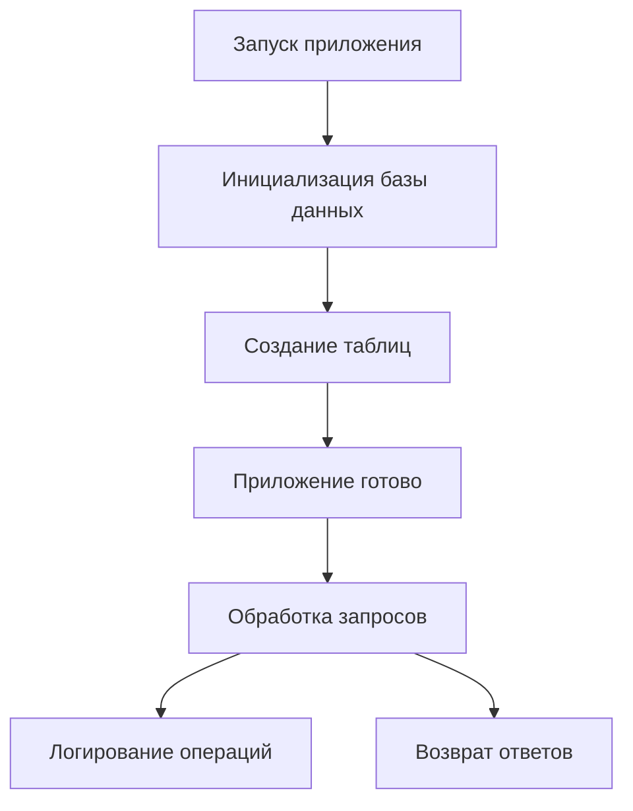

# 👥 Система управления пользователями

Современное веб-приложение для эффективного управления пользователями с надежной системой безопасности.

## 📋 Обзор проекта

Данное приложение представляет собой полнофункциональную систему для управления пользователями, которая обеспечивает безопасную регистрацию, аутентификацию и контроль доступа. Идеально подходит для интеграции в различные проекты, требующие базового функционала работы с пользователями.

### 🎯 Для чего предназначено

- **Создание пользовательских аккаунтов** с уникальными учетными данными
- **Безопасная аутентификация** через стандартные протоколы
- **Централизованное управление** пользовательской базой
- **Аудит и мониторинг** пользовательской активности
- **Интеграция с внешними системами** через REST API

## ✨ Ключевые возможности

| Функция | Описание | Статус |
|---------|----------|--------|
| 🔐 **Безопасная регистрация** | Создание новых пользовательских аккаунтов | ✅ Готово |
| 🛡️ **Аутентификация** | Проверка личности пользователей | ✅ Готово |
| 📊 **Управление пользователями** | Просмотр и управление базой пользователей | ✅ Готово |
| 📝 **Аудит действий** | Полное логирование всех операций | ✅ Готово |
| ⚡ **Высокая производительность** | Асинхронная обработка запросов | ✅ Готово |
| 🔄 **Автоматическая инициализация** | Самостоятельная настройка при запуске | ✅ Готово |

## 🚀 API Документация

### 📝 Быстрый старт

#### 1. Регистрация нового пользователя

**Endpoint:** `GET /me/basic-auth`

Регистрирует нового пользователя в системе или проверяет существующие учетные данные.

**🔐 Аутентификация:** HTTP Basic Auth

**📤 Запрос:**
```bash
curl -X GET "http://ваш-сервер/me/basic-auth" \
  -u "имя_пользователя:пароль"
```

**📥 Успешный ответ (200):**
```json
{
  "status": 200,
  "username": "ivan_petrov",
  "password": "secure_password_123"
}
```

**⚠️ Возможные ошибки:**
- `401 Unauthorized` - неверные учетные данные или пользователь уже существует

---

#### 2. Получение списка всех пользователей

**Endpoint:** `GET /me/basic_all`

Возвращает полный список зарегистрированных пользователей системы.

**📤 Запрос:**
```bash
curl -X GET "http://ваш-сервер/me/basic_all"
```

**📥 Успешный ответ (200):**
```json
[
  {
    "id": 1,
    "username": "ivan_petrov",
    "password": "secure_password_123"
  },
  {
    "id": 2,
    "username": "maria_ivanova",
    "password": "my_secret_456"
  }
]
```

### 📊 Примеры использования

#### Регистрация пользователя через браузер
1. Откройте любой REST клиент (Postman, Insomnia)
2. Выберите метод `GET`
3. Введите URL: `http://ваш-сервер/me/basic-auth`
4. В разделе аутентификации выберите `Basic Auth`
5. Введите имя пользователя и пароль
6. Отправьте запрос

#### Получение всех пользователей
```bash
# Простой запрос без аутентификации
curl -X GET "http://ваш-сервер/me/basic_all"
```

## 🎯 Практическое использование

### 🔧 Установка и настройка

#### Системные требования
- Современная операционная система (Windows, macOS, Linux)
- Доступ к сети интернет
- Любой REST клиент или веб-браузер

#### Первый запуск
1. Запустите приложение на вашем сервере
2. Дождитесь сообщения об успешной инициализации
3. Система автоматически создаст все необходимые таблицы
4. Приложение готово к работе!

### 💡 Сценарии использования

#### 🎪 Сценарий 1: Создание первого пользователя
```bash
# Регистрация администратора
curl -X GET "http://ваш-сервер/me/basic-auth" \
  -u "admin:admin123"
```

#### 🎪 Сценарий 2: Массовая регистрация пользователей
```bash
# Создание нескольких пользователей
curl -X GET "http://ваш-сервер/me/basic-auth" -u "user1:pass1"
curl -X GET "http://ваш-сервер/me/basic-auth" -u "user2:pass2"
curl -X GET "http://ваш-сервер/me/basic-auth" -u "user3:pass3"
```

#### 🎪 Сценарий 3: Аудит пользователей
```bash
# Просмотр всех зарегистрированных пользователей
curl -X GET "http://ваш-сервер/me/basic_all"
```

### 🛡️ Безопасность и лучшие практики

#### ✅ Что реализовано
- **Базовая аутентификация**: Стандартный протокол HTTP Basic Auth
- **Аудит действий**: Полное логирование всех запросов с временными метками
- **Уникальные учетные записи**: Предотвращение дублирования пользователей
- **Асинхронная обработка**: Высокая производительность при большой нагрузке

#### 🔒 Рекомендации по безопасности
- Используйте сложные пароли для production среды
- Регулярно проверяйте логи на предмет подозрительной активности
- Рассмотрите дополнительные методы аутентификации для критичных систем
- Ограничьте доступ к API только необходимым системам

#### 📊 Мониторинг и логирование
Все операции автоматически записываются в логи:
- Время каждого запроса
- HTTP метод и URL
- Код ответа сервера
- Время обработки запроса

## 🏗️ Архитектура и структура

### 📁 Организация кода

Проект построен по принципу модульной архитектуры, что обеспечивает:
- **Простоту поддержки** - каждый компонент отвечает за свою область
- **Масштабируемость** - легко добавлять новые функции
- **Переиспользуемость** - компоненты можно использовать в других проектах

#### 🗂️ Основные модули

| Модуль | Назначение | Ключевые возможности |
|--------|------------|---------------------|
| **🔀 Маршрутизация** | Управление API endpoints | REST API, аутентификация |
| **📊 Модели данных** | Структура пользователей | Валидация, индексы |
| **📋 Схемы** | Форматы данных | Pydantic модели |
| **💾 База данных** | Управление данными | Асинхронные операции |
| **⚙️ Конфигурация** | Настройки приложения | Гибкая конфигурация |
| **📝 Логирование** | Аудит операций | Детальные логи |

### 🔄 Жизненный цикл приложения



## 📋 Дополнительная информация

### ⚡ Производительность
- **Асинхронная обработка**: Все операции с базой данных выполняются неблокирующе
- **Оптимизированные запросы**: Использование индексов для быстрого поиска
- **Эффективное логирование**: Минимальное влияние на производительность

### 🔧 Технические особенности
- **Автоматическая инициализация**: При первом запуске создаются все необходимые таблицы
- **Современный стек**: Использование актуальных технологий для веб-разработки
- **Стандартизированный API**: Следование REST принципам

### 🚨 Ограничения
- **HTTP Basic Auth**: Подходит для простых сценариев, для сложных систем рекомендуется JWT
- **Хранение паролей**: В production следует использовать хеширование паролей
- **Масштабирование**: Для больших нагрузок может потребоваться оптимизация

### 🔮 Возможности развития
- Добавление ролей и прав доступа
- Интеграция с внешними системами аутентификации
- REST API для управления сессиями
- WebSocket поддержка для real-time уведомлений
- Интеграция с системами мониторинга

---

## 🎉 Заключение

Данная система управления пользователями предоставляет надежную основу для любого проекта, требующего базового функционала работы с пользователями. Простая в использовании, но мощная в возможностях, она станет отличным выбором для быстрого старта вашего проекта.

**Готовы начать?** Следуйте инструкциям выше и ваша система будет работать уже через несколько минут!